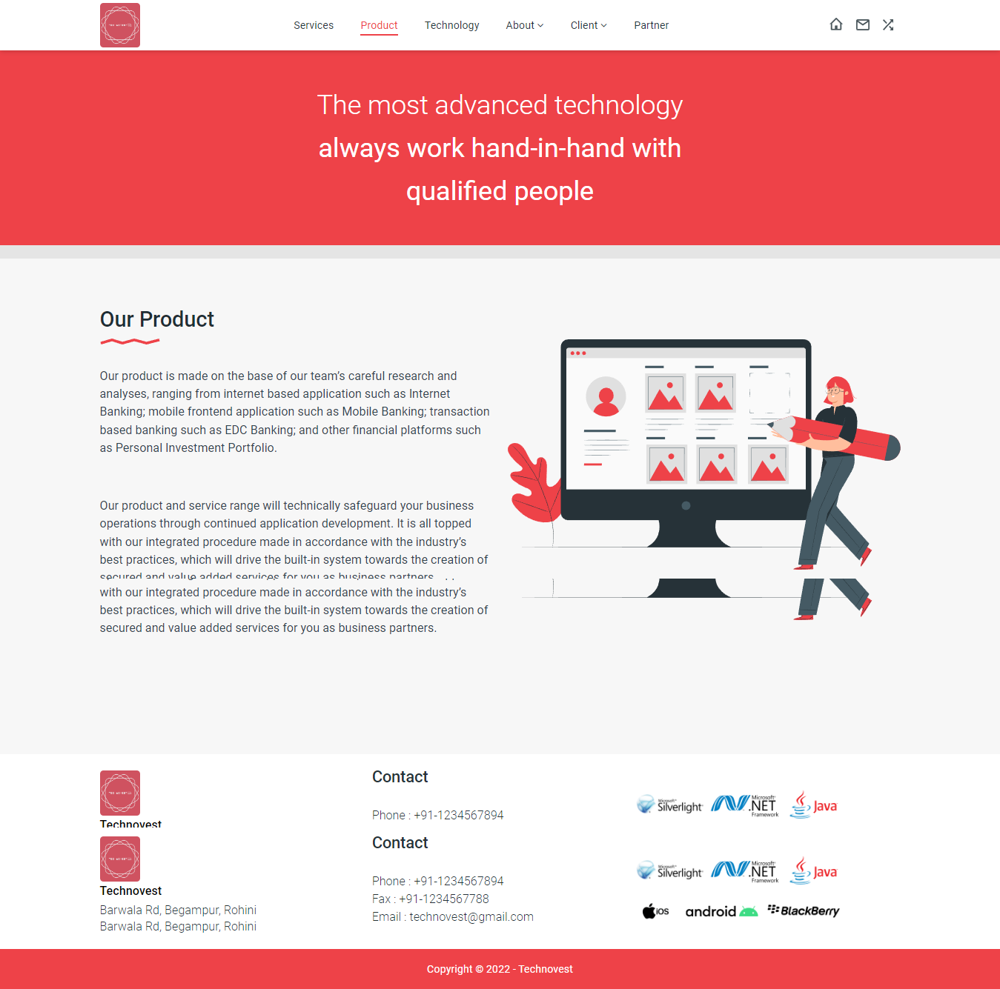

# Technovest
* Technovest website made to share service solutions focus on the front-end based software development.

# About Technovest
* **Perfect to start an website.** 8 screens are availables : Home, Service, Product, Technology, About, Client, Partner and About-Us. You'll find some components like contact, live address, in-screen video.

- **Easy to use** 🤘
- **Made with Expo** ⚡
- **Mobile Friendly**🌞
- **Responsive on all screen size**🧐

# Site Link 
* https://technovest.netlify.app/

## Structure Of The Project

- The home page consists of cards which contains the links to 3 different web pages, services, product and technology.
- Services consits that we offer.
- Our product and service range will technically safeguard your business operations through continued application development.
- Technology provides you an overview of what technologies we use to make our system.
- Then it also has 2 about us page one tells us about our company and other about our employee's.
- In the client section lets you known about how good our work is by our previous clients.
- Technovest is a joint collaboration with several parties that has a good reputation as a business partner, is what partners section contains.

# Tools Used
* The main framework used in building the website is Jquery, JavaScript, Bootstrap and its components like Carousel, Card, Buttons, Navbar etc. It also used HTML5, CSS3 and Google Fonts and Font Awesome.

# Screenshots
### 1. Home Page

## 2. Service Page

## 3. Product Page

## 4. Technology Page

## 5. About Page

## 6. Client Page

## 7. Partner Page

